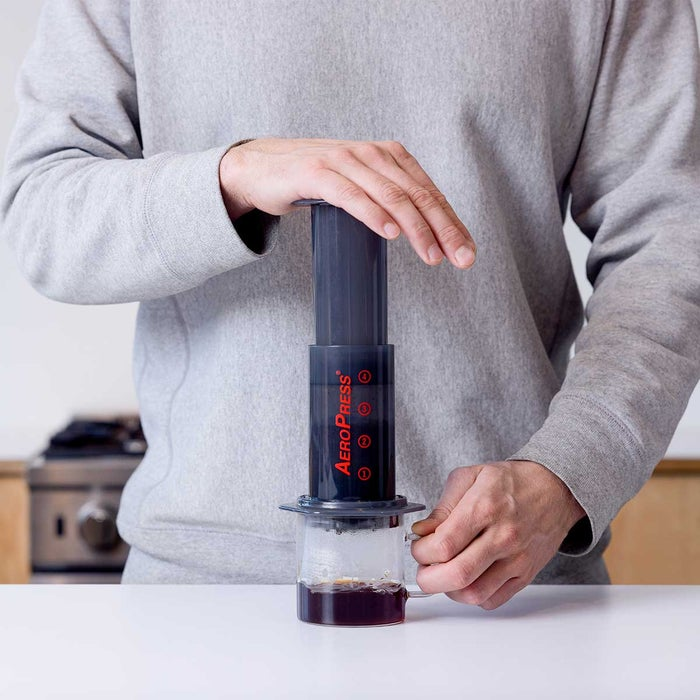
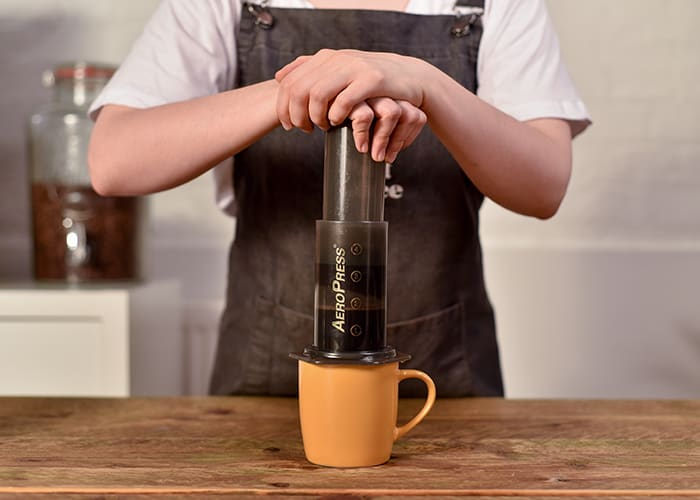

# Normal vs. Inverted AeroPress

{: .no_toc}

You can prepare a coffee in AeroPress in two ways.

### Table of contents

{: .no_toc}

1. TOC
{:toc}

## **Normal/Upright**

If you are a beginner, start with this method. This is the original way of how you can brew a coffee.

- Attach the Filter Cap to the Chamber
- Put the AeroPress on the cup with the Filter Cap end directed downwards
- Add a coffee and water according to the recipe
- When the brewing is complete, attach the Plunger and press it to instill the coffee into the cup

When you pour water it starts to drip through the filter immediately, which can cause less extraction of the coffee.

This method can be used when you are a new user of the AeroPress. It is slightly easier and safer to the beginners than the Inverted method.

## **Inverted**

- Join the Chamber and the Plunger together
- Set the rubber end of the Plunger on number 4 on the Chamber scale
- Put the AeroPress on a flat surface with the Filter Cap end directed upwards
- Add a coffee and water according to the recipe
- After a stirring attach the Filter Cap with filters to the Chamber
- When the brewing is complete flip the AeroPress, put it on the cup with a Filter Cap end directed downwards and press it to instill the coffee into the cup
  

This method allows you to brew a coffee for as long as you want because the coffee doesn't drip through the filter while brewing. When you flip the AeroPress, the grinds become fully saturated. For the safety reasons be careful when you flip the AeroPress. Please see [Safety notices](../Safety-notices/index.md)